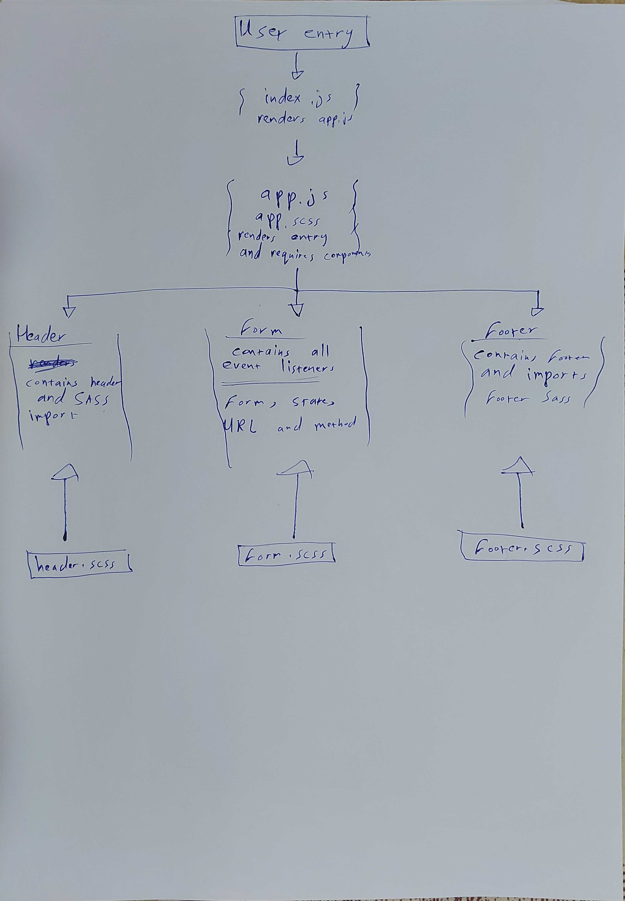

# LAB - 26

## RESTy 

### Author: Ammar Badwan

### Links and Resources

- [Pull Request]()

### How to initialize the application

* `npm start`

### Deployed links
- [GitHub Pages](https://ammarbadwan-401-advanced-javascript.github.io/resty/)

- [Netlify](https://vigorous-jennings-a939a3.netlify.app/)

### UML

